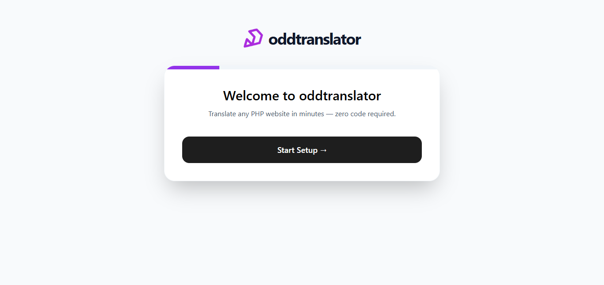

<h1 style="display: flex; align-items: center; gap: 8px;">
  
  oddtranslator
</h1>

**Self-contained, zero-code drop-in translation engine for any PHP website.**

Upload the folder → run the one-click activator → instantly add professional multi-language translation to your entire site with smart caching. No coding, no plugins, no bloat.



## Table of Contents

- [Features](#-features)
- [Quick Start (60 seconds)](#-quick-start-60-seconds)
- [How It Works](#-how-it-works)
- [Folder Structure](#-folder-structure)
- [Integrations & Providers](#-integrations--providers)
- [Requirements](#-requirements)
- [Roadmap](#-roadmap)
- [License](#-license)

## ✨ Features

- **True Zero-Code Integration** — `oddt-enable.php` automatically activates the engine (no manual `require_once`)
- **Works on Any PHP Site** — Plain PHP, WordPress, Laravel, custom CMS, legacy code — everything
- **SEO-Friendly URL Translation** — Zero-config `?lang=es` parameter for indexable, crawlable pages
- **Server-Side Rendering** — Optional output buffering for full-page HTML translation (faster, no JS parsing)
- **Language Widget** — Floating button
- **8 Languages Built-In** — English, Spanish, French, German, Italian, Portuguese, Japanese, Chinese
- **MyMemory Default** — Works immediately with no API key (5k → 50k characters/day)
- **Multi-Provider Support** — Easily switch to DeepL, Microsoft Translator, LibreTranslate via API keys
- **Composite-Key Caching** — MD5 hash + target language = zero cache collisions between languages
- **Skip Protection** — Protect prices, brand names, code blocks with `.oddt-skip` or `data-oddt-skip`
- **Fully Isolated** — All CSS/JS uses `oddt-` namespace (no theme conflicts)

## 🚀 Quick Start (60 seconds)

1. Upload the entire `oddt/` folder to your website root directory.
2. Visit `https://your-site.com/oddt/oddt-enable.php` to automatically run the zero-code activator. This script will inject the necessary code into your `index.php` to enable the translation engine without any manual coding.
3. Verify that the activation script displays an `injected` status for your `index.php` file.
4. Click the "Proceed to Installer" button to run the secure installer.
4. Complete the 4-step wizard to set up your database connection and admin account.
5. Done! Your site now has a working translation widget.

**Manual fallback:** Add one line at the top of your `index.php`:
```php
<?php require_once $_SERVER['DOCUMENT_ROOT'] . '/oddt/boot.php'; ?>
```

## 🔧 How It Works

1. `boot.php` checks for `.installed` lock and conditionally starts `HtmlInjector::start()` for automatic widget injection.
2. On requests with `?lang=es` (or any target language), output buffering intercepts the page HTML and translates visible text nodes server-side.
3. Without `?lang` parameter, pages render in English (original language) — no unwanted translation.
4. `oddt-translator.js` renders the floating language selector widget with dynamic viewport positioning.
5. Visitor clicks the widget → selects a language → page reloads with `?lang=XX` appended to URL.
6. Backend checks MD5 cache (keyed by hash + language) → returns instantly if available.
7. On cache miss: translates using the active provider → saves to composite-key cache → page displays translated content.
8. All skip selectors (`.oddt-skip`, `data-oddt-skip`, `.price`, `.no-translate`) remain untouched during translation.

## 📁 Folder Structure

```text
oddt/
├── assets/
│   ├── css/
│   │   ├── oddt-style.css              # Compiled frontend widget styles (namespaced, isolated)
│   │   └── oddt-admin.css              # Compiled admin panel UI styles
│   ├── js/
│   │   ├── installer.js                # Multi-step installation wizard behavior
│   │   ├── oddt-translator.js          # DOM walker, skip logic, and frontend UI triggers
│   │   └── oddt-admin.js               # Admin panel dashboard event handlers
│   ├── screenshots/
│   │   └── oddt-installer-welcome-screen.png
│   └── oddt-logo-solid.png
│
├── src/
│   ├── Auth/
│   │   └── Session.php                 # Native PHP session management + login guard
│   ├── css/
│   │   ├── admin-src.css               # Raw Tailwind admin entry point (preflight enabled)
│   │   └── frontend-src.css            # Raw Tailwind widget entry point (preflight disabled)
│   ├── Database/
│   │   └── Connection.php              # PDO singleton, settings & cache table managers
│   ├── Engine/
│   │   ├── Translator.php              # Core translation coordinator & cache router
│   │   └── ProviderRegistry.php        # Factory pattern: dynamically matches active api keys
│   ├── Providers/
│   │   ├── ProviderInterface.php       # Contract enforced across all translation drivers
│   │   ├── MyMemoryProvider.php        # Primary engine (free, no API key required)
│   │   ├── GoogleFreeProvider.php      # Scraper-based fallback system
│   │   ├── DeepLProvider.php           # Premium integration engine
│   │   ├── MicrosoftTranslatorProvider.php # Enterprise integration engine
│   │   └── LibreTranslateProvider.php  # Self-hosted integration engine
│   └── Utils/
│       └── HtmlInjector.php            # Output buffer processor for asset injection
│
├── vendor/
│   └── stichoza/                       # Pre-bundled core library for GoogleFreeProvider
│
├── views/                              # Modular UI template files (processed by admin.php)
│   ├── header.php                      # Navigation container + application navbar
│   ├── footer.php                      # Structural markup closure scripts
│   ├── dashboard.php                   # Statistics analytics + engine health flags
│   ├── configure.php                   # Floating buttons, rules, and skip selectors
│   ├── integrations.php                # Target API gateway selections
│   ├── settings.php                    # Maintenance actions + database tests
│   └── license.php                     # Premium feature verification panel
│
├── admin.php                           # Centralized control panel route gatekeeper
├── boot.php                            # Initial bootstrap layer (spins up output buffers)
├── installer.php                       # Server check evaluator and configuration engine
├── installer-form.php                  # Interactive setup step wizard interface
├── login.php                           # Dashboard secure login interface
├── translate.php                       # Asynchronous endpoint routing live text scripts
├── oddt-enable.php                     # One-click script injection trigger tool
│
├── postcss.config.js                   # Vendor autoprefixer pipeline settings
├── tailwind.admin.config.js            # Standard compilation build configuration layout
├── tailwind.frontend.config.js         # Isolated `oddt-` prefixed theme build definitions
├── package.json                        # Node script task executor definitions
├── package-lock.json                   # Dependency tree state record ledger
├── .gitignore                          # Block pattern rules (excludes node_modules/)
├── LICENSE                             # Project licensing agreement
└── README.md                           # Core documentation registry
```

## 🌐 Language Switching via URL

Pages are translated by appending the `?lang` parameter to the URL:

```
https://your-site.com/page.php?lang=es       # Spanish
https://your-site.com/page.php?lang=fr       # French
https://your-site.com/page.php?lang=de       # German
https://your-site.com/page.php                # English (default, no translation)
```

**Benefits:**
- SEO-friendly: Search engines can index translated versions separately
- Shareable: Users can send translated links to friends
- Zero JavaScript: Works even if frontend JS is disabled
- Bookmarkable: Translations persist across page reloads
- No client-side parsing required: Server handles all translation

The frontend widget (`oddt-translator.js`) automatically handles language switching by reloading the page with the appropriate `?lang=` parameter.

## 🚫 Skip Selectors

Elements matching these selectors are protected from translation:

```html
<p class="oddt-skip">This text won't be translated</p>
<div data-oddt-skip>Protected content</div>
<span class="price">$19.99</span>          <!-- Prices never translate -->
<code class="no-translate">myFunction()</code>
```

## 🔑 Integrations & Providers

- **Default:** MyMemory (no key needed)
- Add your own keys for:
  - DeepL
  - Microsoft Translator
  - LibreTranslate
  - Google Free (fallback)

Higher-traffic sites can upgrade quality and limits instantly.

## 📈 Requirements

- PHP 8.0+
- MySQL / MariaDB
- PDO_MYSQL + cURL extensions
- Write permissions on `/oddt/` folder during install

## Roadmap

- **v0.0.1** — Core engine + MyMemory + Integrations (Current)

## License

This project is licensed under the MIT License.

---

**Made with ❤️ for PHP developers and site owners who want powerful translation without the headache.**

Star the repo if this helps you!